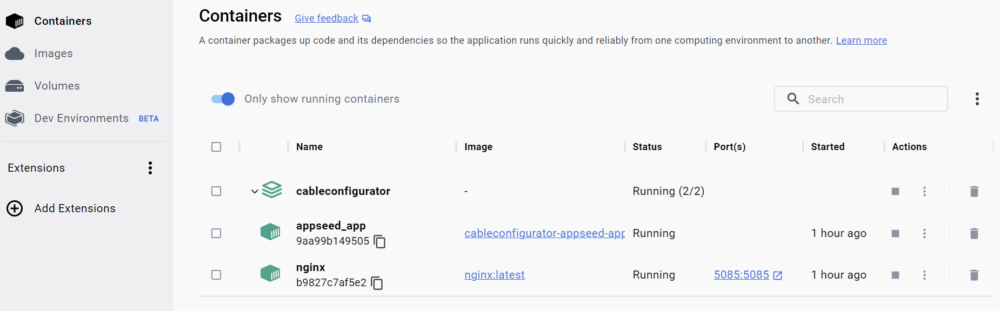

## Installing Python
Make sure you have Python installed on your system. You can download the latest version of Python from the official [Python website](https://www.python.org/downloads/).

## Installing Docker Desktop
Download and install Docker Desktop from the official [Docker website](https://www.docker.com/products/docker-desktop).

## Starting the Django Server and frontend
Open the console and navigate into the root folder of the project and (depending on your system) type `docker compose up` or `docker-compose up`. To shutdown, open a separate terminal tab or window and type `docker compose down` or `docker-compose down` respectively. This should create 2 images "folder_name-app-seed" for the django_prototype, and nginx. The containers should also get started and they should typically look like below indicating that django backend server can now be started through its respective port in the localhost.

Once, the above container appears in the Docker Desktop, it can be started and stopped in the Docker Desktop directly without having to open the command line.

## Admin console of Django Server and Super User Creation
Step 1: Open the terminal of the "folder_name-app-seed" container in the Docker Desktop.

Step 2: Enter cmd "python manage.py migrate" to migrate the database.

Step 3: Create super user with the cmd "python manage.py createsuperuser --username=some_username --email=some_email" and also enter the passwords after that.

Step 4: Upon successful creation of super user, navigate to this url "http://localhost:5085/admin" and login as an admin. 

Step 5: Once done, the frontend app can be started successfully in 5085 port. The db entries for various models like Akkuvariante, Kabelvariante, color, etc., can be added into the database either through the admin console or directly through the developer mode in the front end app "http://localhost:5085/developer_mode".

